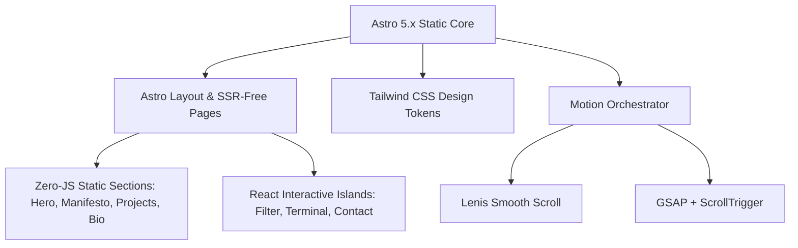

# Architectural Specification & Implementation Plan: Premium Creative Engineering Portfolio

> **Project Goal**: Engineer an Awwwards-tier, modern, agency-grade developer & creative engineering portfolio for Hammad / Hashir using **Astro**, **TypeScript**, **Tailwind CSS**, **GSAP + ScrollTrigger**, and **Lenis Smooth Scroll**, preceded by visual exploration via **Google Stitch MCP**.

---

## 1. Project Analysis & Architectural Assessment

### Current State
- **Workspace**: `e:\Hammad_Portfolio`
- **Existing Files**: Clean slate containing solely `Prompt.md` (the comprehensive design and engineering brief).
- **Environment**: Node.js `v25.8.1`, npm `11.11.0`, Git `2.53.0.windows.2`.
- **Google Stitch MCP**: Verified online, authenticated, and ready for design exploration and theme generation.

### Architectural Decisions
- **Framework Choice**: **Astro 5.x** configured for static generation (`output: 'static'`). Astro ensures near-zero client runtime JavaScript by default, isolating client reactivity to specific interactive islands.
- **Styling Architecture**: **Tailwind CSS v4 / v3.4** integrated with CSS custom properties (`@theme` / `:root`) for strict design token enforcement.
- **Motion Architecture**: **Lenis** (smooth scroll) paired with **GSAP 3.x + ScrollTrigger** via a centralized orchestrator. **No Framer Motion** to eliminate bundle weight redundancy and animation conflicts.
- **UI & Islands**: **React 19** utilized strictly where complex interactive state is indispensable (e.g., interactive project filter, contact interaction, live terminal playground). All other layout, text, and structure remain pure Astro components for maximum speed and SEO.



---

## 2. Information Architecture (IA)

The narrative structure guides recruiters, technical leads, and clients through a continuous story of technical depth and creative craft:

```
PORTFOLIO NARRATIVE
│
├── 01. Dynamic Island Navigation Dock (Floating glass pill, live status beacon, section links, resume CTA)
│
├── 02. The Hero: "Identity & Creative Vector"
│   ├── Architectural eyebrow badge: "Available for Q2/Q3 Roles" (Live Pulsing Telemetry)
│   ├── Typographic Headline: Full-Stack Craftsman & AI/ML Engineer
│   ├── Positioning Thesis: High-performance web applications, scalable backend systems, intelligent AI agents
│   └── Nested "Button-in-Button" CTAs (Explore Selected Work / Connect)
│
├── 03. The Manifesto / Architectural Thesis
│   ├── Large-scale editorial type reveal
│   └── Core belief: "Where structural engineering rigor converges with cinematic frontend craft"
│
├── 04. Curated Selected Works (The Core Proof)
│   ├── Project 01: Intelligent Healthcare Platform (MERN + ML Predictive Diagnostics)
│   ├── Project 02: Full-Stack AI Automation & Agent Workflow Engine (LangChain + FastAPI + Next/React)
│   ├── Project 03: Real-Time Collaborative / FinTech Dashboard (High-frequency telemetry & WebSockets)
│   └── Project 04: Interactive Creative Experience (WebGL / Canvas / Fluid UX experiment)
│
├── 05. Capabilities & Engineering Matrix
│   ├── Category A: Frontend & Creative Engineering (Astro, React, TypeScript, GSAP, Tailwind, CSS Architecture)
│   ├── Category B: Backend & Cloud Infrastructure (Node.js, Express, MongoDB, PostgreSQL, REST/GraphQL)
│   ├── Category C: AI/ML & Intelligent Systems (Python, LangChain, PyTorch, Model Fine-Tuning, RAG Pipelines)
│   └── Category D: Systems, Performance & DevOps (Docker, Git, CI/CD, Core Web Vitals, Edge deployment)
│
├── 06. Interactive Engineering Lab / Sandbox
│   ├── Live code/terminal micro-module demonstrating technical depth & execution quality
│
├── 07. Professional Trajectory & Experience
│   ├── Stepper timeline detailing software engineering milestones, production metrics, and key impacts
│
├── 08. About & Philosophy
│   ├── Personal backstory, intellectual curiosity, engineering standards, open source contributions
│
├── 09. High-Conversion Contact Lounge
│   ├── Direct interactive copyable email, project inquiry form, social endpoints (GitHub, LinkedIn, X)
│
└── 10. Colophon & System Telemetry Footer
    ├── Tech stack acknowledgment, local time display, build commit hash, accessibility status
```

---

## 3. User Flow & Cognitive Journey

```mermaid
sequenceDiagram
    autonumber
    actor V as Visitor (Tech Recruiter / Lead)
    participant H as Hero (0-5s)
    participant M as Manifesto & Proof (5-20s)
    participant P as Selected Works (20-60s)
    participant C as Capabilities Matrix
    participant CTA as Contact Lounge

    V->>H: Lands on page; perceives custom typography, smooth Lenis scroll, instant 60fps load
    H-->>V: Answers: "Who is this?" (Full-Stack Engineer & Creative Architect)
    V->>M: Scrolls into Manifesto
    M-->>V: Answers: "What is their engineering philosophy?" (Rigor + Taste)
    V->>P: Engages with Project Showcase (Sticky split preview + tech decisions)
    P-->>V: Answers: "What have they actually shipped?" (Full-stack MERN & AI/ML Platforms)
    V->>C: Inspects Capabilities & Technical Lab
    C-->>V: Answers: "Can they handle complex systems?" (Verified deep stack)
    V->>CTA: Reaches Contact Lounge
    CTA-->>V: Frictionless one-click action: Schedule call, copy email, open GitHub
```

---

## 4. Visual Design Direction & Design System

### Aesthetic Archetype: Neo-Architectural Obsidian Glass
Synthesizing deep cosmic black surfaces with precision hairline geometric borders, soft diffused ambient glows, and high-contrast editorial typography.

- **Double-Bezel (Doppelrand) Architecture**: Major cards and containers sit inside an outer machine-cut shell (`p-1.5 rounded-[2rem] bg-white/[0.03] ring-1 ring-white/[0.08]`) with an inner high-contrast core (`rounded-[calc(2rem-0.375rem)] bg-[#12141A] shadow-[inset_0_1px_1px_rgba(255,255,255,0.08)]`).
- **Button-in-Button Trailing Icons**: CTAs feature integrated circular nested wrappers for icon glyphs (`↗`) with independent spring transitions.
- **Fixed Ambient Grain**: High-frequency subtle noise overlay (`pointer-events-none fixed inset-0 opacity-[0.025] z-50`) giving physical paper-grade texture without scroll GPU repaints.

---

## 5. Typography System

| Role | Font Family | Fallback | Sizing & Weight | Usage |
| :--- | :--- | :--- | :--- | :--- |
| **Display / Hero** | `Space Grotesk` / `Cabinet Grotesk` | `system-ui, sans-serif` | `clamp(2.75rem, 7vw, 6.5rem)`, 700/800, `-0.03em` tracking | Hero Title, Massive Editorial Manifesto |
| **Headings (H1/H2)** | `Space Grotesk` | `sans-serif` | `clamp(1.75rem, 4vw, 3.25rem)`, 600, `-0.02em` tracking | Section Titles, Featured Project Headers |
| **Body Copy** | `Geist` / `Inter` | `sans-serif` | `1rem` - `1.125rem`, 400, `1.65` line-height | Explanatory text, project case studies |
| **Micro / Eyebrow** | `Space Grotesk` | `sans-serif` | `0.6875rem` - `0.75rem`, 600, `0.2em` uppercase tracking | Eyebrow pills, Category markers |
| **Technical Telemetry** | `JetBrains Mono` | `monospace` | `0.8125rem`, 500, `0.02em` tracking | Tech tags, code snippets, timestamps, metrics |

---

## 6. Color Tokens & Palette

| Token Name | Hex / Value | Semantic Role |
| :--- | :--- | :--- |
| `--bg-void` | `#090A0F` | Absolute base canvas (Deep OLED Black with subtle slate tint) |
| `--surface-card-outer` | `rgba(255, 255, 255, 0.03)` | Outer bezel ring/shell background |
| `--surface-card-inner` | `#11131A` | Inner core card surface |
| `--surface-elevated` | `#171A24` | Hovered interactive components, popovers, active tabs |
| `--border-hairline` | `rgba(255, 255, 255, 0.08)` | Structural 1px division rules & card contours |
| `--border-active` | `rgba(99, 102, 241, 0.4)` | Focus states, active step nodes, hovered borders |
| `--text-primary` | `#F5F6FA` | Headings, primary statements, crisp contrast |
| `--text-secondary` | `#9DA1B4` | Paragraph text, case study descriptions |
| `--text-tertiary` | `#5D6175` | Captions, disabled labels, line dividers |
| `--accent-electric` | `#6366F1` | Primary brand vector (Electric Indigo) |
| `--accent-telemetry` | `#10B981` | Live status pulse, verified indicators (Emerald) |
| `--accent-gold` | `#F59E0B` | Highlight keywords, special achievements (Warm Amber) |

---

## 7. Component Architecture (Astro + Selective React)

```
src/
├── layouts/
│   └── BaseLayout.astro              <-- HTML5 shell, SEO meta, Lenis + GSAP initialization, Grain overlay
├── components/
│   ├── navigation/
│   │   ├── Navbar.astro              <-- Floating glass pill with dynamic backdrop blur
│   │   └── MobileNav.astro           <-- Fluid fullscreen staggered morph drawer
│   ├── hero/
│   │   ├── Hero.astro                <-- Master hero section with GSAP split text
│   │   ├── AvailabilityBeacon.astro  <-- Live pulse telemetry pill
│   │   └── HeroActionDock.astro      <-- Dual-bezel CTA container with button-in-button icons
│   ├── manifesto/
│   │   └── Manifesto.astro           <-- Scroll-triggered typography reveal
│   ├── projects/
│   │   ├── ProjectSection.astro      <-- Editorial sticky-split project showcase container
│   │   ├── ProjectCard.astro         <-- Double-bezel project card with technical decisions
│   │   └── ProjectFilter.tsx         <-- [React Island] Client-side category switching (All, Full-Stack, AI/ML)
│   ├── capabilities/
│   │   ├── CapabilitiesMatrix.astro  <-- 4-pillar technical matrix with proficiency depth
│   │   └── TechBadge.astro           <-- JetBrains Mono micro-capsule with subtle glow
│   ├── lab/
│   │   └── InteractiveLab.tsx        <-- [React Island] Live micro-sandbox / interactive code runner
│   ├── experience/
│   │   └── ExperienceTimeline.astro  <-- Numbered milestone trajectory with impact stats
│   ├── about/
│   │   └── AboutSection.astro        <-- Asymmetrical bio layout with technical philosophy
│   ├── contact/
│   │   ├── ContactLounge.astro       <-- High-conversion contact hub with direct copy & timezone
│   │   └── ContactForm.tsx           <-- [React Island] Accessible interactive contact sender
│   ├── footer/
│   │   └── Footer.astro              <-- Colophon, commit hash, return to top trigger
│   └── ui/
│       ├── DoubleBezel.astro         <-- Master reusable double-bezel container
│       ├── Button.astro              <-- Reusable primary/secondary button-in-button
│       └── EyebrowTag.astro          <-- Micro-capsule typography pill
├── data/
│   ├── projects.ts                   <-- Structured project data (names, problem, solution, metrics, repo, demo)
│   ├── experience.ts                 <-- Career & education milestones
│   └── skills.ts                     <-- Categorized skill taxonomy
├── scripts/
│   ├── lenis-orchestrator.ts         <-- Centralized Lenis smooth scroll coordinator
│   └── gsap-animations.ts            <-- Reusable GSAP timeline & ScrollTrigger instances
└── styles/
    └── global.css                    <-- Design tokens, custom scrollbars, keyframe utilities
```

---

## 8. Motion Architecture & Hierarchy

To prevent chaotic animation, motion follows strict semantic tiers:

```
MOTION HIERARCHY
├── Level 1: Micro-Transitions (CSS GPU Transitions: 150-250ms cubic-bezier(0.16, 1, 0.3, 1))
│   └── Button hover scale (0.98 -> 1.02), inner icon translation, border luminosity
│
├── Level 2: Component Entry Choreography (GSAP Timelines on Load: 600-900ms)
│   └── Hero title stagger, eyebrow pill fade-up, action dock soft elevation
│
├── Level 3: Scroll-Triggered Discoveries (GSAP ScrollTrigger + Lenis)
│   └── Manifesto word-by-word opacity illumination, Project card parallax reveal, timeline progress track
│
└── Level 4: Reduced Motion Fallback
    └── When prefers-reduced-motion: reduce is active, all transforms collapse to instant opacity
```

---

## 9. Lenis + GSAP Integration Strategy

```typescript
// Architectural Pattern: src/scripts/lenis-orchestrator.ts
import Lenis from 'lenis';
import { gsap } from 'gsap';
import { ScrollTrigger } from 'gsap/ScrollTrigger';

export function initScrollSystem() {
  if (window.matchMedia('(prefers-reduced-motion: reduce)').matches) {
    return; // Honor user accessibility preferences
  }

  gsap.registerPlugin(ScrollTrigger);

  const lenis = new Lenis({
    duration: 1.1,
    easing: (t) => Math.min(1, 1.001 - Math.pow(2, -10 * t)),
    smoothWheel: true,
  });

  // Synchronize Lenis scroll positions with GSAP ScrollTrigger
  lenis.on('scroll', ScrollTrigger.update);

  gsap.ticker.add((time) => {
    lenis.raf(time * 1000);
  });
  gsap.ticker.lagSmoothing(0);

  return lenis;
}
```

---

## 10. Responsive Strategy

Every layout is engineered with explicit breakpoints:
- **Mobile (`320px - 640px`)**: Single-column vertical flow (`grid-cols-1`). Any complex desktop sticky-split unfolds into linear storytelling. Section padding set to `py-16 px-4`. Touch targets maintain a minimum of `48px x 48px`.
- **Tablet (`641px - 1023px`)**: 2-column bento modules, expanded navigation drawer, `py-20 px-6`.
- **Desktop (`1024px - 1440px`)**: Full sticky-split project previews, 1280px max-width container with `py-28 px-8`.
- **Ultra-Wide (`1440px+`)**: Strict container constraints (`max-w-7xl mx-auto`) to avoid overstretched typography.

---

## 11. Performance Strategy

1. **Astro Static Generation (`SSG`)**: Pure pre-rendered HTML served instantly from CDN.
2. **GPU-Bound Animations**: Exclusively animating `transform3d` (x, y, scale) and `opacity`. Zero layout-triggering properties (`top`, `margin`, `height`).
3. **Local Asset Strategy**: Self-hosted variable Google Fonts (`Space Grotesk`, `Geist`, `JetBrains Mono`) via `@fontsource` to prevent external network hops and FOIT/FOUT.
4. **Optimized Visual Assets**: Modern WebP/AVIF formats with explicit `width`, `height`, and `loading="lazy"`.

---

## 12. Accessibility (a11y) Strategy

- **Semantic Landmark Layout**: Native `<header>`, `<nav>`, `<main>`, `<section aria-labelledby="...">`, `<article>`, and `<footer>`.
- **WCAG 2.1 AA Contrast**: All body text maintains minimum 7:1 contrast ratio against the dark background.
- **Focus Rings**: High-visibility keyboard navigation focus rings (`focus-visible:outline-none focus-visible:ring-2 focus-visible:ring-indigo-500 focus-visible:ring-offset-2 focus-visible:ring-offset-[#090A0F]`).
- **Screen Reader Support**: Hidden `sr-only` labels on icon buttons and external links (`aria-label="Visit GitHub Repository (opens in new tab)"`).

---

## 13. Google Stitch MCP Design Exploration Plan

Before locking the final styling code, we leverage the connected **Google Stitch MCP**:
1. **Design System Query**: Use Stitch MCP to explore high-fidelity design tokens for *Dark Luxury Creative Engineering Portfolio* (validating color contrast, radius tokens, and font pairing).
2. **Screen Generation**: Generate a reference concept screen via `generate_screen_from_text`:
   - Prompt: *"Awwwards-tier dark-mode creative developer portfolio hero and selected works showcase. Obsidian slate background, double-bezel cards, hairline borders, Space Grotesk typography, electric indigo highlights, and technical telemetry tags."*
3. **Visual Extraction**: Inspect the generated design layout, spacing scale, and component hierarchy to guide the Astro components.

---

## 14. Step-by-Step Implementation Phases

```mermaid
gantt
    title Portfolio Implementation Roadmap
    dateFormat  X
    axisFormat  Day %j

    section Architecture
    Phase 1: Project Scaffolding & Dependencies   :active, p1, 0, 1
    Phase 2: Token System & Global Styles         :p2, 1, 2
    section Core UI
    Phase 3: Base Layout & Floating Nav Dock      :p3, 2, 3
    Phase 4: Hero Choreography & Manifesto        :p4, 3, 4
    Phase 5: Editorial Project Showcase           :p5, 4, 5
    section Secondary UI
    Phase 6: Capabilities & Experience Timeline   :p6, 5, 6
    Phase 7: Interactive Lab, About & Contact     :p7, 6, 7
    section Motion & QA
    Phase 8: Lenis + GSAP Scroll Integration      :p8, 7, 8
    Phase 9: Responsive, a11y & Performance Audit :p9, 8, 9
    Phase 10: Production Build & Review           :p10, 9, 10
```

- **Phase 1: Project Initialization**: Initialize Astro in `e:\Hammad_Portfolio`, install Tailwind CSS, `@astrojs/react`, `gsap`, `lenis`, `lucide-react`, and font packages.
- **Phase 2: Token System**: Configure `tailwind.config.mjs` and `src/styles/global.css` with the obsidian color palette, typography scales, and double-bezel utilities.
- **Phase 3: Base Layout & Nav**: Build `BaseLayout.astro`, floating glass `Navbar.astro`, and mobile drawer.
- **Phase 4: Hero & Manifesto**: Implement `Hero.astro` with live status telemetry and the `Manifesto.astro` statement.
- **Phase 5: Project Showcase**: Implement `ProjectSection.astro`, `ProjectCard.astro`, and the `ProjectFilter.tsx` island with real MERN and AI/ML case studies.
- **Phase 6: Capabilities & Experience**: Implement the 4-pillar matrix and career trajectory timeline.
- **Phase 7: Interactive Lab & Contact**: Build the live micro-sandbox and accessible contact lounge.
- **Phase 8: Motion Integration**: Connect Lenis smooth scroll and GSAP ScrollTrigger timelines.
- **Phase 9: Comprehensive Audit**: Validate across viewport widths (320px to 1920px), test keyboard navigation, and verify lighthouse metrics.
- **Phase 10: Final Polish**: Validate production bundle (`npm run build`).

---

## Verification Plan

### Automated Build & Lint Verification
- Command: `npm run build`
  - Validates that Astro produces clean static HTML without bundling errors, broken links, or syntax faults.
- Command: `npx astro check`
  - Validates TypeScript typing and component contracts.

### Manual UX & Visual Verification
1. **Motion & Scroll Test**: Smooth 60fps scrolling with Lenis; no jank or layout shift on hero entrance.
2. **Responsive Matrix**: Test across 375px (iPhone), 768px (iPad portrait), 1024px (iPad landscape), and 1440px (Desktop).
3. **Accessibility**: Verify tab navigation moves sequentially through all interactive elements with visible focus rings.
4. **Interactive Islands**: Test project filtering (All / Full-Stack / AI-ML) and contact copy-to-clipboard functionality.
